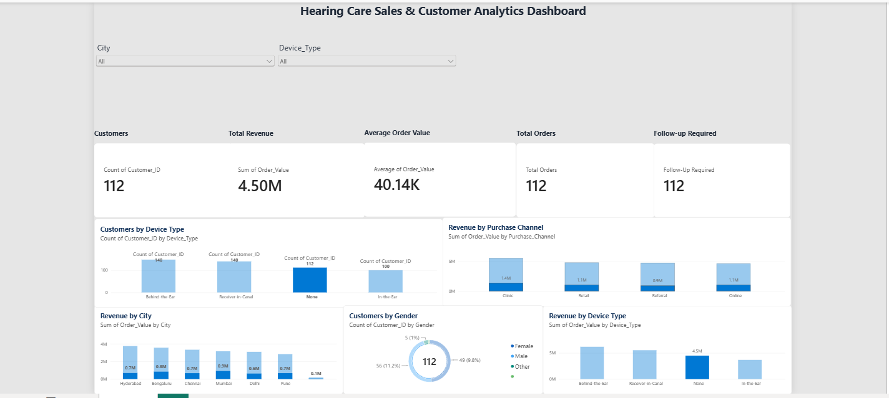

# Hearing Care Sales & Customer Analytics

A Power BI dashboard project focused on analyzing hearing care sales, customer behavior, device types, purchase channels, and follow-up requirements.

## 📊 Project Overview

This project analyzes hearing care customer and sales data to generate actionable business insights through an interactive Power BI dashboard.

The dashboard helps understand:
- Customer distribution by device type
- Revenue performance across cities
- Revenue by purchase channel
- Customer distribution by gender
- Revenue contribution by device type
- Customers requiring follow-up

## 🎯 Business Objectives

- Analyze overall sales and customer performance
- Identify high-performing cities and purchase channels
- Understand device-type demand and revenue contribution
- Track customers requiring follow-up
- Provide an interactive dashboard for business decision-making

## 🛠️ Tools & Technologies

- **Power BI** – Dashboard development and data visualization
- **Python** – Data cleaning and exploratory analysis
- **Pandas** – Data manipulation and analysis
- **SQL** – Business data analysis
- **SQLite** – Database creation and SQL queries

## 📌 Key KPIs

The dashboard tracks:

- **Total Customers:** 500
- **Total Revenue:** 19.90M
- **Average Order Value:** 39.80K
- **Total Orders:** 500
- **Follow-up Required:** 195

## 📈 Dashboard Features

### Interactive Filters
- City
- Device Type

### Visualizations
- Customers by Device Type
- Revenue by Purchase Channel
- Revenue by City
- Customers by Gender
- Revenue by Device Type

## 🐍 Python & SQL Analysis

The Python analysis includes:

- Dataset inspection
- Data types analysis
- Missing-value detection and handling
- Duplicate-row detection
- Customer analysis
- Revenue analysis
- Device-type analysis
- City-wise revenue analysis
- Purchase-channel analysis
- Follow-up analysis

SQLite is used to create a customer database and perform SQL-based business analysis.

## 📂 Project Files

| File | Description |
|---|---|
| `Dashboard.png` | Preview of the Power BI dashboard |
| `Hearing_Care_Analytics.pbix` | Power BI dashboard file |
| `hearing_care_data.csv` | Project dataset |
| `data_analysis.py` | Python data cleaning, analysis and SQL queries |
| `README.md` | Project documentation |

## 🖼️ Dashboard Preview

## 🚀 How to Use

1. Download `Hearing_Care_Analytics.pbix`.
2. Open the file using Microsoft Power BI Desktop.
3. Use the City and Device Type filters to explore the dashboard.
4. Review the Python and SQL analysis in `data_analysis.py`.

## 👨‍💻 Skills Demonstrated

**Power BI | Data Analytics | Python | Pandas | SQL | SQLite | Data Visualization | Business Intelligence**
